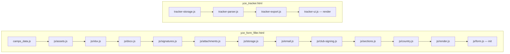
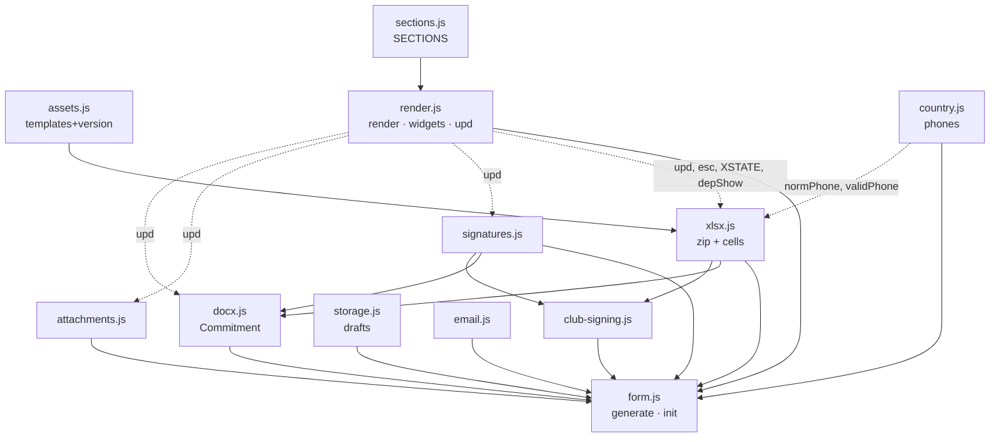

# Code map — Lions YCE Belgium

> Detailed map of the codebase: screens, modules, business functions, sizes and dependencies.
> Generated against commit `4d5cb3b` + form.js split (2026-08-05).
> **Interactive version:** open [`code_map.html`](code_map.html) (served on the site at `/docs/code_map.html`) —
> regenerate its data with `python3 tools/build_codemap.py` after refactoring.

## 1. Screens & entry points

| Screen | Entry | Mode switch | Lines | Size | Notes |
|---|---|---|---:|---:|---|
| Public site + camp explorer | `index.html` | — | 1 304 | 95 KB | Monolithic page (see §5) |
| Application form (candidate) | `yce_form_filler.html` | `?district=A/B/C/D`, `?country=XX` | 149 | 11 KB | HTML shell + `<style>`; loads the 10 filler modules |
| Club counter-signing | `yce_form_filler.html` | `?sign=club` | ″ | ″ | Same shell, mode flag read by `form.js`/`club-signing.js` |
| Coordinator admin | `yce_form_filler.html` | `?admin` | ″ | ″ | Same shell, unlocks admin widgets |
| Applications tracker | `yce_tracker.html` | — | 129 | 8 KB | HTML shell; loads the 4 tracker modules |

Script load order (classic scripts, shared global scope — **order matters**, each page's last module runs the page init):

## 2. Filler modules (`js/`)

Total filler code: **1 285 lines / 66 KB** across 12 modules (+ `assets.js`, 505 KB generated payload). No module exceeds ~220 lines.

### js/xlsx.js — 219 lines, 9.9 KB — zip library + workbook cell I/O
| Function | Line | LOC | Role |
|---|---:|---:|---|
| `crc32` / `CRC_TABLE` | 8 | 5 | CRC-32 for zip writing |
| `inflateRaw` / `deflateRaw` | 13 | 9 | native `(De)CompressionStream` wrappers |
| `unzip(buf)` | 22 | 28 | parse a zip (EOCD → central dir) into `[{name,data}]` |
| `buildZip(entries,mime)` | 50 | 39 | rebuild a zip Blob (deflate when available, else store) |
| `decodeEnt` / `textOf` / `parseShared` | 89 | 12 | XML entities, `<t>` runs, sharedStrings table |
| `getCellValue(xml,sst,ref)` | 101 | 13 | read one cell (sharedStr / inlineStr / numeric) |
| `syncFromTemplate(buf)` | 115 | 42 | prefill inputs + X-groups from a loaded workbook; sets `currentDistrict` |
| `loadTemplate` / `templateBuf` | 157 | 13 | "Other template…" file input handler |
| `setStatus(msg,err)` | 170 | 4 | status bar helper (used by every module) |
| `setCell(xml,ref,val,num)` | 181 | 15 | write/clear one cell, keeping its style |
| `collectValues()` | 196 | 24 | gather all field values (+ phone normalisation & validation) |
| Depends on | | | `assets.js` (template), `form.js` (SECTIONS, XSTATE, depShow, upd, normPhone) |

### js/docx.js — 173 lines, 9.7 KB — Commitment to Reciprocity
| Function | Line | LOC | Role |
|---|---:|---:|---|
| `COMMIT_TEXT_DEFAULT` / `COMMIT_TEXT` / `COMMIT` | 4 | 15 | official text, per-browser override, validation state |
| `commitShow()` | 21 | 22 | sync validate button + Attachments card UI |
| `commitCardClick()` | 43 | 25 | card: scroll to section / direct download of the signed docx |
| `commitToggle()` | 68 | 13 | validate (requires applicant+parent signatures) / cancel |
| `commitTextShow/Upload/Reset` | 81 | 42 | admin: replace the text from an uploaded Word doc |
| `docxReplaceRun` / `docxSigRun` | 123 | 20 | XML surgery: swap a marker run for an inline image |
| `buildCommitmentDoc(fam,fir)` | 143 | 31 | fill `§CAND§`/`§DATE§`/`[BODY]`, paste signatures, leave `SIGSLOT_*` bookmarks |
| Depends on | | | `assets.js` (COMMIT_B64), `xlsx.js` (unzip, buildZip, escXml…), `signatures.js` (SIGS) |

### js/signatures.js — 81 lines, 4.4 KB — signature pads
| Function | Line | LOC | Role |
|---|---:|---:|---|
| `SIGS` / `sigInit()` | 5 | 23 | canvas pads (pointer events), auto-fill of the date field |
| `sigClear` / `sigUpload` | 28 | 25 | clear pad / load a signature image scaled into the pad |
| `dataUrlToBytes` | 53 | 2 | dataURL → bytes |
| `addSignatures(entries)` | 55 | 27 | anchor inked pads as PNGs on rows 127/129/131/133/135 of the workbook |
| Depends on | | | `form.js` (upd) |

### js/attachments.js — 80 lines, 3.2 KB — pass photo & payment proof
| Function | Line | LOC | Role |
|---|---:|---:|---|
| `PHOTO` / `photoPick/Show/Clear` | 5 | 30 | photo upload, downscale to 800 px JPEG, preview |
| `PAY` / `payPick/Show/Clear` | 35 | 45 | payment proof: PDF kept as-is, images downscaled to 1 600 px |
| Depends on | | | `xlsx.js` (setStatus), `form.js` (upd) |

### js/storage.js — 62 lines, 2.8 KB — local draft
| Function | Line | LOC | Role |
|---|---:|---:|---|
| `saveDraft()` (debounced) | 7 | 17 | persist fields, X-groups, signatures, photo, proof, commitment state |
| `restoreDraft()` | 24 | 31 | restore everything incl. conditional-field visibility |
| `clearForm()` | 55 | 8 | wipe draft + reload |
| Depends on | | | every state owner (SIGS, PHOTO, PAY, COMMIT, XSTATE) |

### js/email.js — 47 lines, 3.2 KB — prefilled e-mails
| Function | Line | LOC | Role |
|---|---:|---:|---|
| `mailPresident()` | 6 | 22 | mailto: club e-mail (E69), signing instructions + `?sign=club` link |
| `mailCoordinator()` | 28 | 20 | mailto: district coordinator (E79/I78), file list, sponsoring club |
| Depends on | | | `xlsx.js` (currentDistrict, setStatus) |

### js/club-signing.js — 30 lines, 1.8 KB — `?sign=club` mode
| Function | Line | LOC | Role |
|---|---:|---:|---|
| `loadCommitFile()` | 6 | 9 | load the candidate's Commitment docx |
| `signCommitmentFile()` | 15 | 16 | insert the club signature at the `SIGSLOT_CLUB` bookmark |
| Depends on | | | `xlsx.js` (unzip, buildZip), `docx.js` (docxSigRun), `signatures.js` (SIGS) |

### js/sections.js — 163 lines, 10.6 KB — declarative form definition
| Block | Line | LOC | Role |
|---|---:|---:|---|
| `CAMPS` (derived from `camps_data.js`) | 5 | 7 | country/camp suggestion list |
| `IS_ADMIN` / `SIGN_CLUB` | 12 | 2 | mode flags from the URL |
| `SECTIONS` (+ commitment push) | 14 | 149 | **the form**: 12 sections, ~90 fields with cell refs, widths, types, modes |
| Depends on | | | `camps_data.js` only — pure configuration, no logic |

### js/country.js — 87 lines, 4.1 KB — default country & phone numbers
| Function | Line | LOC | Role |
|---|---:|---:|---|
| `COUNTRIES` / `CTRY` / `countryCfg` | 4 | 32 | 20 countries with dial code & nationality; `?country=` / localStorage |
| `normPhone` / `validPhone` | 36 | 22 | international normalisation (`0…`, `00…`, pasted `+…`) & validation |
| `wirePhones` / `applyCountry` / `setCountry` | 58 | 30 | tel-input wiring, nationality/country prefills, admin selector |
| Depends on | | | `render.js` (upd) at runtime |

### js/render.js — 204 lines, 10.8 KB — rendering, widgets & counter
| Function | Line | LOC | Role |
|---|---:|---:|---|
| `esc` / `render()` | 4 | 113 | render all sections/field types (text, date, select, ynbtn, pills, xgroup, sig, photo, payproof, download, commit block) |
| `depShow` / `XSTATE` / `xsel` | 118 | 22 | X-choice groups + conditional "specify" fields |
| `initLists` / `syncCamps` | 140 | 16 | country & per-preference camp datalists |
| `ynClick` / `refreshYn` | 157 | 16 | Yes/No & pill buttons backed by hidden inputs |
| `updState` / `upd()` | 173 | 33 | State-field visibility + fields-completed counter (drives `saveDraft`) |
| Depends on | | | `sections.js` (SECTIONS), state owners (SIGS, PHOTO, PAY, COMMIT) |

### js/form.js — 138 lines, 6.4 KB — orchestration
| Function | Line | LOC | Role |
|---|---:|---:|---|
| `generate()` | 4 | 88 | validate → write cells → signatures → downloads (xlsx, Commitment, photo, proof) → e-mail buttons; sign-mode branch |
| `init()` (+ call) | 92 | 47 | mode setup, district fetch, template sync, country, pads, drafts |
| Depends on | | | every other module — loaded last |

### js/assets.js — GENERATED, 505 KB
`BUILD` (version stamp), `TEMPLATE_B64` (blank District C form, stored uncompressed), `COMMIT_B64` (Commitment template). Regenerate with `python3 tools/build_assets.py`.

## 3. Tracker modules (`js/`)

Total tracker code: **272 lines / 16 KB**.

| Module | Lines | Size | Functions (line · LOC) | Role / depends on |
|---|---:|---:|---|---|
| `tracker-storage.js` | 14 | 0.6 KB | `save` 8·1, `clearAll` 9·6 | `ROWS` + localStorage persistence |
| `tracker-parser.js` | 174 | 9 KB | `unzip` 8·28, `getCell` 45·10, `handleFiles` 65·36, `parseForm` 101·37, `findRowByName` 138·9, `matchCommit` 147·18, `matchAux` 165·10 | file ingestion: ZIP explode (xlsx first), form extraction (27 `REQUIRED` fields, signature anchors, age), commitment/photo/proof matching → storage, ui.log |
| `tracker-export.js` | 22 | 1.3 KB | `exportCsv` 4·19 | 24-column CSV (BOM + `;`) → storage |
| `tracker-ui.js` | 62 | 4.8 KB | `render` 11·43, `setDist`/`setSort`, `log`, `isComplete`, drag&drop wiring | table, filters, sorting, stats, status/notes editing → storage, parser |

## 4. Cross-module dependency graph (filler)

Solid arrows = "is used by"; dotted = upward calls at runtime (UI helpers owned by `form.js`).
`setStatus` (xlsx.js) and `upd`/`esc` (render.js) are the two de-facto shared utility hubs — candidates for a future `js/ui-utils.js`.

## 5. index.html — public site (1 304 lines, 95 KB, monolithic)

| Block | Content |
|---|---|
| `<style>` (~410 lines) | site + explorer + map + modal styles, light/dark themes, responsive |
| Sections | nav, hero (stats), program, **explorer**, Brussels camp, apply (district cards, docs, `?sign=club` link), testimonials, team, footer |
| Explorer JS (~550 lines) | table: `getFiltered/getSorted/renderTable/applyFilters/resetFilters` + continent/country/state/age/fee/period filters · map (D3/TopoJSON): `initMap/renderWorldBubbles/zoomContinent/renderCountryBubbles/zoomCountry/showCountryCamps` + breadcrumb/back · camp modal: `showCampDetail/buildTimeline` · `toggleTheme`, `switchTab` |
| Data | `camps_data.js` (88 KB — `SEASON` + `RAW`, 91 camps, shared with the filler) |
| External deps | D3 7.8.5 + TopoJSON 3.0.2 (CDN) — the only runtime dependencies of the whole project |

## 6. Totals

| | Files | Lines of code | Size |
|---|---:|---:|---:|
| Filler (shell + 12 modules) | 13 | 1 434 | 78 KB |
| Tracker (shell + 4 modules) | 5 | 401 | 25 KB |
| Public site | 1 | 1 304 | 95 KB |
| Generated payload (`assets.js`) | 1 | — | 505 KB |
| Season data (`camps_data.js`) | 1 | — | 87 KB |
| Tooling (`tools/`) | 2 | 45 | 90 KB (incl. docx template) |
